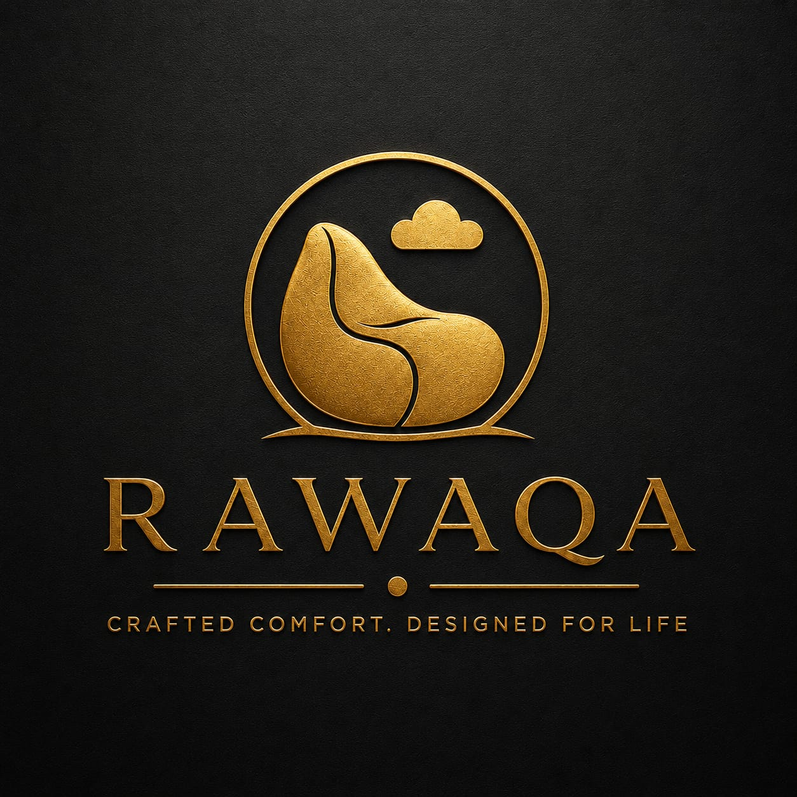

<div align="center">



# RAWAQA — رواقة

### راحة حرفية. مصممة للحياة.
### Crafted Comfort. Designed for Life.

[](https://nextjs.org)
[](https://www.typescriptlang.org)
[](https://mongodb.com)
[](https://tailwindcss.com)
[](.)

</div>

---

## 📋 نظرة عامة | Overview

**RAWAQA** هو موقع تجارة إلكترونية متكامل لبيع كراسي البين باج الفاخرة في السوق المصري. يدعم اللغتين العربية والإنجليزية، ويتكامل مع Odoo ERP وخدمة SMS للإشعارات.

**RAWAQA** is a full-stack e-commerce platform for premium bean bag chairs in the Egyptian market. Bilingual Arabic/English, integrated with Odoo ERP and SMS notifications.

---

## 🏗️ هيكل المشروع | Project Structure

```
RAWAQA/
├── frontend/          # Next.js 14 — TypeScript — Tailwind CSS
│   ├── src/
│   │   ├── app/       # App Router pages (AR/EN i18n)
│   │   ├── components/
│   │   ├── context/   # Cart, Auth, Toast
│   │   ├── lib/       # API client, types, utils
│   │   └── i18n/      # next-intl routing
│   └── public/
│       ├── products/  # Product images
│       └── hero/      # Hero slideshow images
│
├── backend/           # Node.js — TypeScript — Express
│   ├── src/
│   │   ├── controllers/
│   │   ├── services/
│   │   ├── models/    # Mongoose models
│   │   ├── routes/
│   │   ├── middleware/
│   │   └── workers/   # Outbox + Inventory workers
│   └── dist/          # Compiled output
│
└── docs/              # Full project documentation (118+ files)
    └── 00-ai/         # AI context layer
```

---

## ⚡ التقنيات | Tech Stack

### Frontend
| Technology | Version | Purpose |
|------------|---------|---------|
| Next.js | 14.2 | React framework + App Router |
| TypeScript | 5.x | Type safety |
| Tailwind CSS | 3.x | Styling |
| next-intl | 3.x | Arabic/English i18n |
| Cairo Font | Google | Arabic typography |
| Fraunces | Google | English display font |

### Backend
| Technology | Version | Purpose |
|------------|---------|---------|
| Node.js | ≥18 | Runtime |
| TypeScript | 5.3 | Type safety |
| Express | 4.18 | HTTP framework |
| Mongoose | 8.x | MongoDB ODM |
| JWT + bcryptjs | — | Authentication |
| Zod | 3.x | Input validation |
| Winston | 3.x | Logging |
| node-cron | 3.x | Background workers |
| Vonage SDK | — | SMS notifications |

### Database & Services
| Service | Purpose |
|---------|---------|
| MongoDB | Primary database |
| Odoo ERP | Order management |
| Vonage | SMS order confirmations |

---

## 🚀 تشغيل المشروع محلياً | Local Development

### المتطلبات | Prerequisites

- Node.js ≥ 18
- MongoDB (local or Atlas)
- npm ≥ 9

### Frontend

```bash
cd frontend
npm install
npm run dev
# → http://localhost:3000
```

### Backend

```bash
cd backend
cp .env.example .env
# Edit .env with your MongoDB URI and other credentials
npm install
npm run dev
# → http://localhost:5002
```

### Seed Database

```bash
cd backend
npm run seed
# Creates: admin user, categories, products
```

---

## 🌐 المتغيرات البيئية | Environment Variables

### Frontend (`frontend/.env.local`)

```env
NEXT_PUBLIC_API_URL=http://localhost:5002/api
```

### Backend (`backend/.env`)

```env
# Database
MONGODB_URI=mongodb://localhost:27017/rawaqa

# Authentication
JWT_ACCESS_SECRET=your-secret-key
JWT_REFRESH_SECRET=your-refresh-secret
JWT_ACCESS_EXPIRES_IN=15m
JWT_REFRESH_EXPIRES_IN=7d

# SMS (Vonage)
SMS_PROVIDER=vonage
VONAGE_API_KEY=your-key
VONAGE_API_SECRET=your-secret
VONAGE_FROM_NUMBER=RAWAQA

# Odoo
ODOO_URL=https://your-odoo-instance.com
ODOO_DB=your-database
ODOO_USERNAME=api_user
ODOO_PASSWORD=your-password

# Admin
ADMIN_EMAIL=admin@rawaqa.com
ADMIN_PASSWORD=StrongPassword123
```

---

## 📱 الصفحات | Pages

| Route | الصفحة | Auth |
|-------|--------|------|
| `/ar` or `/en` | الصفحة الرئيسية | Public |
| `/[locale]/shop` | المتجر | Public |
| `/[locale]/product/[id]` | تفاصيل المنتج | Public |
| `/[locale]/cart` | سلة التسوق | Public |
| `/[locale]/checkout` | إتمام الطلب | **Required** |
| `/[locale]/order-confirmation/[n]` | تأكيد الطلب | — |
| `/[locale]/track` | تتبع الطلب | Public |
| `/[locale]/login` | تسجيل الدخول | — |
| `/[locale]/register` | إنشاء حساب | — |
| `/[locale]/account` | حسابي | Required |
| `/admin` | لوحة التحكم | Admin |
| `/admin/products` | إدارة المنتجات | Admin |
| `/admin/orders` | إدارة الطلبات | Admin |
| `/admin/settings` | إعدادات الموقع | Admin |

---

## 🛒 المنتجات | Products

| المنتج | SKU | السعر |
|--------|-----|-------|
| كرسي لاونج | RWQ-LC-001 | 1,815 ج.م |
| كرسي لاونج كلاسيك | RWQ-LC-002 | 1,815 ج.م |
| بين باج 8-بول | RWQ-8B-001 | 1,650 ج.م |
| بين باج كورة — L | RWQ-FB-L | 1,270 ج.م |
| بين باج كورة — XL | RWQ-FB-XL | 1,430 ج.م |
| بين باج كورة — 2XL | RWQ-FB-2XL | 1,610 ج.م |
| بين باج كورة — 3XL | RWQ-FB-3XL | 1,920 ج.م |
| كرسي لاونج مخمل + فوتة | RWQ-CHL-001 | 1,920 ج.م |

---

## 🎨 نظام التصميم | Design System

```css
--charcoal:    #15130F  /* خلفية رئيسية */
--ivory:       #F7F4EC  /* خلفية فاتحة */
--gold-light:  #D2B56A  /* Accent رئيسي */
--gold:        #AD8A4C  /* Accent ثانوي */
--ink:         #262117  /* نص رئيسي */
```

**Fonts:** Cairo (Arabic) · Fraunces (Display) · Manrope (Body)

---

## 🔒 الأمان | Security

- ✅ JWT authentication (15m access / 7d refresh)
- ✅ bcryptjs password hashing (cost 10)
- ✅ MongoDB sanitization (NoSQL injection prevention)
- ✅ Rate limiting on auth endpoints
- ✅ Helmet security headers
- ✅ Input validation with Zod
- ✅ CORS configuration
- ✅ Checkout requires authentication

---

## 🌍 الدعم الدولي | Internationalization

- 🇸🇦 **العربية** — الافتراضية، RTL layout، خط Cairo
- 🇬🇧 **English** — LTR layout، خط Fraunces + Manrope
- Toggle في الـ Navbar للتبديل بين اللغتين
- جميع المحتوى مترجم (المنتجات، الواجهة، رسائل الخطأ)

---

## 📦 الـ Deploy | Deployment

### Vercel (Frontend)

```bash
cd frontend
vercel --prod --yes
```

### Backend (VPS / Railway / Render)

```bash
cd backend
npm run build
npm start
```

---

## 📄 التوثيق | Documentation

- [`docs/00-ai/`](docs/00-ai/) — AI Context Layer (للـ AI agents)
- [`docs/02-requirements/FRS.md`](docs/02-requirements/FRS.md) — Functional Requirements
- [`docs/04-api/API-Design.md`](docs/04-api/API-Design.md) — API Documentation
- [`docs/05-database/ERD.md`](docs/05-database/ERD.md) — MongoDB Schema
- [`backend/API-DOCUMENTATION.md`](backend/API-DOCUMENTATION.md) — Full API Reference
- [`backend/DEPLOYMENT.md`](backend/DEPLOYMENT.md) — Deployment Guide

---

## 💰 النطاق التجاري | Commercial Scope

| المرحلة | التكلفة |
|---------|---------|
| Frontend Development | 12,000 ج.م |
| Backend Development | 10,000 ج.م |
| Odoo Integration | 7,000 ج.م |
| SMS Integration | 3,000 ج.م |
| Testing & Deployment | 3,000 ج.م |
| **الإجمالي** | **35,000 ج.م** |

---

## 🇪🇬 صنع في مصر | Made in Egypt

<div align="center">

**RAWAQA** — راحة حرفية. مصممة للحياة.

</div>
