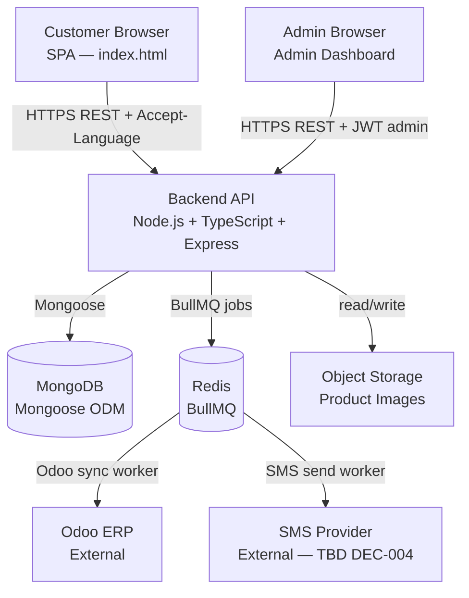
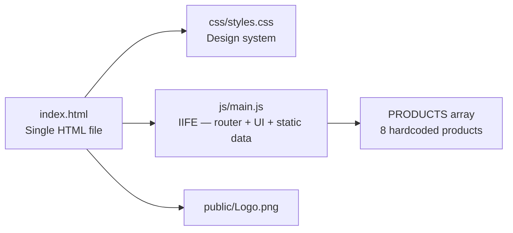
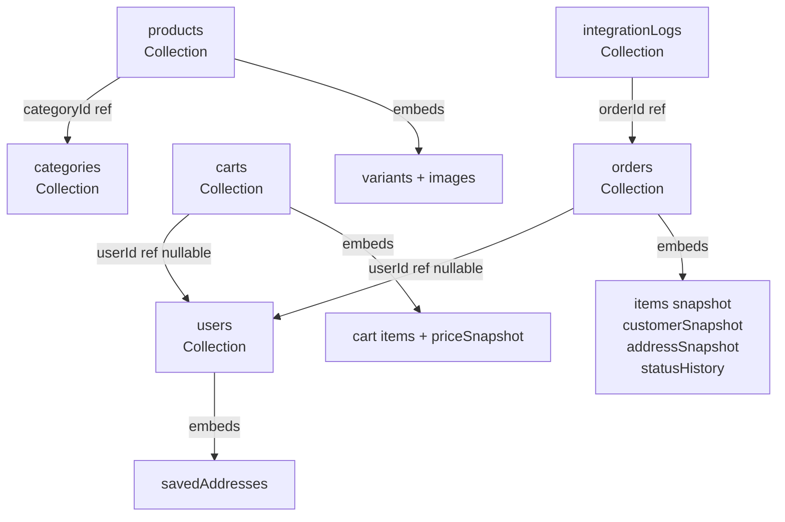
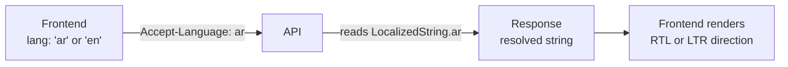

# Architecture-Summary — RAWAQA

**Last updated:** 2026-09-02 (v2.0 — MongoDB + TypeScript + bilingual)
**Status:** Describes the TARGET architecture. Backend not yet implemented.

> **⚠️ SUPERSEDED:** Any reference in this file to PostgreSQL, Prisma, SQL, or "TBD backend stack" is obsolete. The confirmed stack is Node.js + TypeScript + Express + MongoDB + Mongoose.

---

## 1. System Architecture (Target)



**Current reality:** Customer Browser layer partially exists (static prototype). Everything below the browser is not yet built.

---

## 2. Frontend Architecture (Current — Static SPA)



**Frontend is vanilla ES5 — no framework, no build step, no npm (DEC-011).**

**Target additions after API connection:**
```
js/
├── main.js     ← existing (refactor: replace static array with API calls)
├── api.js      ← NEW: fetch wrapper, Accept-Language header, X-Session-ID
├── cart.js     ← NEW: cart state, sessionId management
└── auth.js     ← NEW: JWT storage, login/logout
```

---

## 3. Backend Architecture (Target — Not Yet Built)

```mermaid
graph TD
    ENTRY[Express HTTP Entry\nPort 3000]
    MW[Middleware\nCORS · Rate Limit · Auth/Session · Zod Validator · Pino · Error Handler]

    subgraph Routes
        PR[/api/products]
        CR[/api/cart]
        OR[/api/orders]
        AR[/api/auth]
        TR[/api/orders/track]
        ADM[/api/admin/]
    end

    subgraph Services
        PS[ProductService]
        CS[CartService]
        OS[OrderService]
        AS[AuthService]
        ADMS[AdminService]
    end

    subgraph Repositories
        UR[UserRepository]
        PR2[ProductRepository]
        CR2[CartRepository]
        OR2[OrderRepository]
        LR[IntegrationLogRepository]
    end

    subgraph Jobs
        Q[BullMQ Queue\nodoo-sync · sms-send]
        OW[OdooSyncWorker\nXmlRpcOdooAdapter]
        SW[SmsSendWorker\nSmsAdapter]
    end

    MDB[(MongoDB)]

    ENTRY --> MW --> PR & CR & OR & AR & TR & ADM
    PR --> PS --> PR2 --> MDB
    CR --> CS --> CR2 --> MDB
    OR --> OS --> OR2 --> MDB
    OS --> Q --> OW & SW
    AR --> AS --> UR --> MDB
    ADM --> ADMS
```

---

## 4. Data Model Architecture (MongoDB)



**Key modeling decisions:**
- Variants and images **embedded** in products — always fetched together
- Cart items **embedded** — bounded size; always fetched with cart
- Order items **embedded as immutable snapshots** — historical data preserved regardless of product changes
- `customerSnapshot` and `shippingAddress` **embedded** — point-in-time capture
- `integrationLogs` **separate collection** — high volume, queried independently

Full schema: `docs/05-database/ERD.md`

---

## 5. Localization Architecture



**LocalizedString pattern** in MongoDB:
```json
{ "name": { "ar": "الكرسي السحابي", "en": "The Cloud Lounger" } }
```

API returns resolved string (not the object) to customer endpoints. Admin endpoints return full `{ ar, en }` object.

Default language: **Arabic** when `Accept-Language` absent (DEC-023).

Full specification: `docs/03-architecture/Localization-Architecture.md`

---

## 6. Authentication Architecture

```
POST /api/auth/login
        ↓
Validate email + password
        ↓
bcrypt.compare (cost ≥ 12)
        ↓
Issue JWT access token (15 minutes) + refresh token (7 days)
        ↓
Store refresh token HASH in users.refreshTokenHash
        ↓
Return access token in body; refresh token in HttpOnly cookie

Protected routes:
        ↓
Extract Bearer token from Authorization header
        ↓
Verify JWT signature + expiry (JWT_SECRET)
        ↓
Attach { userId, role } to request context
        ↓
adminOnly middleware: check role === 'admin'
```

**Guest routes:**
```
No JWT → check X-Session-ID header (UUID v4)
        ↓
Valid UUID → guest cart/checkout flow
        ↓
Invalid or absent → 401 on protected endpoints
```

**Admin routes:** All `/api/admin/*` require `role: 'admin'` in JWT.
**Customer routes:** `/api/orders`, `/api/cart` — JWT **or** `X-Session-ID`.
**Public routes:** `GET /api/products`, `GET /api/orders/track/:num`.

---

## 7. Integration Architecture

### Odoo (async, non-blocking — DEC-009, DEC-021)

```
Order confirmed → 201 response sent to customer
        ↓
BullMQ: queue.add('odoo-sync', { orderId })
        ↓
OdooSyncWorker picks up job
        ↓
Check order.odooOrderId — if set, SKIP (idempotent)
        ↓
XmlRpcOdooAdapter.authenticate()
        ↓
Search or create res.partner (by email)
        ↓
Create sale.order with line items (match by SKU)
        ↓
Save odooOrderId → set odooSyncStatus = 'synced'
        ↓
On failure: exponential backoff, max 4 retries
        ↓
After 4 failures: odooSyncStatus = 'failed', log entry
```

### SMS (async, non-blocking — DEC-010, DEC-022)

```
Order confirmed → 201 response sent to customer
        ↓
BullMQ: queue.add('sms-send', { orderId })
        ↓
SmsSendWorker picks up job
        ↓
Check order.smsStatus — if 'sent', SKIP (idempotent)
        ↓
Normalize phone: 01xxxxxxxxx → +20xxxxxxxxx
        ↓
Select template by language (ar or en)
        ↓
SmsAdapter.send(phone, message)
        [ConsoleSmsAdapter in dev — logs to stdout]
        [Real provider adapter when DEC-004 resolved]
        ↓
Set smsStatus = 'sent' or 'failed'
```

---

## 8. Deployment Architecture (Target)

```
[Git Repository]
      ↓ CI/CD (GitHub Actions)
[tsc compile + Jest tests]
      ↓
[Docker image — Node.js backend]
      ↓
[Hosting — TBD DEC-014]
      ├── Backend API (Node.js/TypeScript/Express)
      ├── MongoDB (Atlas or self-hosted — DEC-025)
      ├── Redis (managed or self-hosted)
      └── Static frontend (CDN or same server)
```

---

## 9. Technology Stack

| Layer | Technology | Status |
|-------|-----------|--------|
| Frontend | Vanilla HTML/CSS/ES5 JS | Partially implemented |
| Backend runtime | Node.js | Not implemented |
| Backend language | TypeScript | Not implemented |
| HTTP framework | Express | Not implemented |
| Database | MongoDB | Not implemented |
| ODM | Mongoose | Not implemented |
| Auth | JWT (15m/7d) + bcrypt | Not implemented |
| Validation | Zod | Not implemented |
| Logging | Pino | Not implemented |
| Async jobs | BullMQ + Redis | Not implemented |
| Testing | Jest + Supertest | Not implemented |
| Odoo | XML-RPC adapter | Not implemented |
| SMS (dev) | Console adapter | Not implemented |
| SMS (prod) | TBD (DEC-004) | OPEN |
| Hosting | TBD (DEC-014) | OPEN |

---

## 10. Architectural Constraints

1. No payment gateway — COD only (DEC-005)
2. Frontend is vanilla ES5 SPA — no framework without decision (DEC-011)
3. Odoo and SMS are async — never block order confirmation (DEC-009, DEC-010)
4. MongoDB is the only application database — no SQL, no Prisma (DEC-003-MONGODB)
5. Secrets never in frontend code — API base URL only (SC-001)
6. Order numbers are immutable — format `RWQ-{seq}` (DEC-008)
7. Orders are immutable after creation — status changes only
8. Arabic is the default language (DEC-023)
9. Guest checkout is enabled — `userId` nullable on carts and orders (DEC-013)
10. All localized content uses `{ ar, en }` embedded pattern (DEC-015)

---

## Related Documents

- Full data model: `docs/05-database/ERD.md`
- Field semantics: `docs/05-database/Data-Dictionary.md`
- Full API spec: `docs/04-api/API-Design.md`
- Localization: `docs/03-architecture/Localization-Architecture.md`
- Security: `docs/08-security/Security-Specification.md`
- Auth details: `docs/03-architecture/Auth-Security.md`
- Odoo spec: `docs/06-integrations/Odoo-Integration-Specification.md`
- SMS spec: `docs/06-integrations/SMS-Integration-Specification.md`
- Environment: `docs/10-deployment/Environment-Configuration.md`
