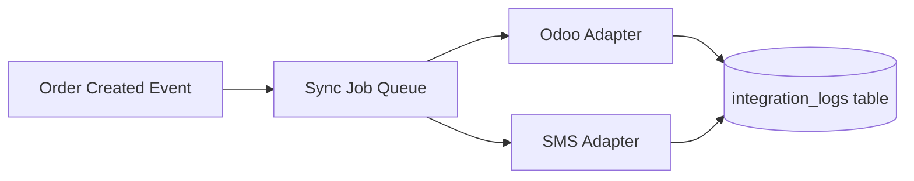

# Component Architecture — RAWAQA

## Frontend Components (Implemented)

| Component | File | Responsibility |
|-----------|------|----------------|
| **Navigation** | `index.html` `.nav`, `#mmenu` | Global nav, cart badge, lang toggle, mobile menu |
| **Router** | `main.js` `go()` | Page switching via `data-route` |
| **ProductCard** | `main.js` `productCard()` | Render catalog card HTML |
| **ProductGrid** | `initProductGrids()` | Featured, shop, related grids |
| **ProductDetail** | `fillProduct()` | Populate PDP from product object |
| **Toast** | `showToast()` | Transient notifications |
| **ScrollAnim** | `initScrollAnimations()` | IntersectionObserver fade-in |
| **CartBadge** | `#cartCount` increment | Partial cart feedback |

### Page Modules

| Page | ID | Key Elements |
|------|-----|--------------|
| Home | `#page-home` | Hero, discover tiles, featured, moment, why, reviews, CTA |
| Shop | `#page-shop` | Filters sidebar, product grid, sort |
| Product | `#page-product` | Gallery, variants, accordion, related |
| Cart | `#page-cart` | Line items, order summary |
| Track | `#page-track` | Search form, result timeline |

---

## Target Backend Modules (Planned)

| Module | Responsibility |
|--------|----------------|
| `auth` | Register, login, JWT, password hash |
| `products` | CRUD, catalog queries, filters |
| `categories` | Category management |
| `cart` | Session/user cart persistence |
| `orders` | Create, list, track, status updates |
| `customers` | Profile, addresses |
| `admin` | Dashboard aggregations, protected routes |
| `integrations/odoo` | Order push, mapping, retry |
| `integrations/sms` | Send, template, log |
| `uploads` | Product image storage |

---

## Admin Architecture (Planned)

**Option A (Recommended for MVP):** Separate admin routes in same SPA or dedicated `/admin` HTML app sharing API.

**Option B:** Server-rendered admin (e.g., lightweight template engine).

**MVP decision:** Admin SPA section with JWT role=`admin`.

| Admin Module | Functions |
|--------------|-----------|
| Dashboard | KPIs, recent orders |
| Products | List, create, edit, delete, image upload |
| Orders | List, detail, status dropdown |
| Customers | Read-only list with order count |
| Settings | SMS/Odoo config (env-backed, read-only in UI) |

---

## Integration Components (Planned)



---

## Repository Structure (Target)

```text
rawaqa/
├── frontend/                 # Current root files (or subfolder)
│   ├── index.html
│   ├── css/
│   ├── js/
│   └── public/
├── backend/                  # Planned
│   ├── src/
│   │   ├── routes/
│   │   ├── services/
│   │   ├── models/
│   │   ├── middleware/
│   │   └── integrations/
│   ├── migrations/
│   └── tests/
├── docs/                     # This pack
├── .env.example
└── docker-compose.yml        # Planned
```

---

## Code Boundaries

| Boundary | Rule |
|----------|------|
| Frontend ↔ API | JSON over HTTPS only |
| API ↔ Database | ORM/repository layer only |
| API ↔ Odoo | Integration service only |
| API ↔ SMS | Notification service only |
| Admin ↔ API | Same API with `role: admin` authorization |

---

## Current Technical Debt

- Monolithic `index.html` (acceptable for MVP; consider component split later)
- No module bundler (add Vite/esbuild when API integration adds complexity)
- Product data duplicated between HTML cart and JS state
