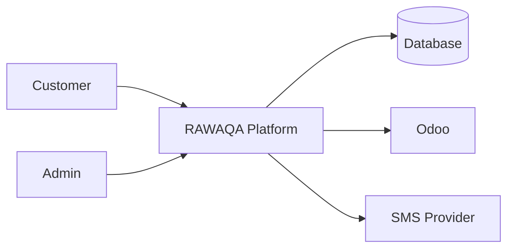
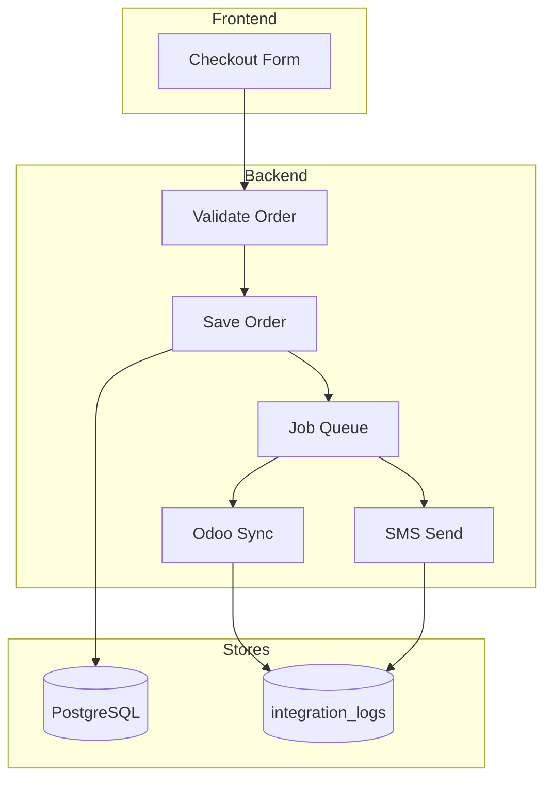

# Data Flow Diagram — RAWAQA

## Level 0 — Context

## Level 1 — Order Creation

## External Entities

| Entity | Role |
|--------|------|
| Customer | Browses, purchases |
| Admin | Manages catalog/orders |
| Odoo | Receives sale orders |
| SMS Provider | Delivers confirmation |

## Data Stores

| Store | Contents |
|-------|----------|
| PostgreSQL | Products, carts, orders, users |
| integration_logs | Odoo/SMS audit trail |
| File storage | Product images |

See [System-Architecture.md](System-Architecture.md) for sequence diagrams.
