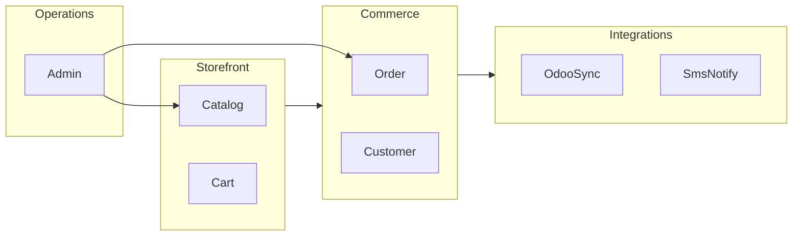

# Domain Model — RAWAQA

## Core Aggregates

| Aggregate | Root Entity | Contains |
|-----------|-------------|----------|
| **Catalog** | Product | Variants, Images, Category |
| **Cart** | Cart | CartItems |
| **Order** | Order | OrderItems, StatusHistory |
| **Customer** | User | Addresses, Orders |
| **Integration** | IntegrationLog | — |

## Bounded Contexts

## Lifecycle States

**Order:** pending → confirmed → preparing → shipped → delivered | cancelled

**Odoo sync:** pending → synced | failed | retrying

**SMS:** pending → sent | failed | skipped

## Invariants

- Order totals = sum(line_totals) + shipping  
- Cart quantity ≤ variant stock  
- Order items snapshot prices at purchase time  
- One confirmation SMS per order  

See [../05-database/ERD.md](../05-database/ERD.md).
