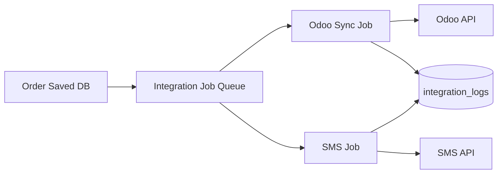

# Integration Architecture — RAWAQA

**Status:** Planned — Integrations **Not Yet Implemented**

Canonical specs:
- [Odoo Integration](../06-integrations/Odoo-Integration-Specification.md)
- [SMS Integration](../06-integrations/SMS-Integration-Specification.md)

---

## Integration Catalog

| Integration | Direction | Sync Mode | Budget |
|-------------|-----------|-----------|--------|
| Odoo ERP | Outbound | Async after order save | 7,000 EGP |
| SMS Provider | Outbound | Async after order save | 3,000 EGP |

**Not in scope:** Inbound webhooks, payment gateways, analytics pixels (unless CR).

---

## Sync vs Async Rules

| Operation | Mode | Rationale |
|-----------|------|-----------|
| Order save | **Sync** | User waits for confirmation |
| Odoo push | **Async** | External latency; don't block UX |
| SMS send | **Async** | Provider latency; don't block UX |
| Product catalog | **Sync** (API read) | User-facing catalog load |

---

## Integration Flow (Post-Checkout)

---

## Retry Policy

| Provider | Max Retries | Backoff | Fail State |
|----------|-------------|---------|------------|
| Odoo | 3 | 30s, 2m, 10m | `odoo_sync_status=failed` |
| SMS | 2 | 30s, 2m | `sms_status=failed` |

---

## Idempotency

- **Odoo:** Key = `order_number` as `client_order_ref`  
- **SMS:** Key = `order_id + event:confirmation`  

---

## Failure Handling

| Failure | User Impact | System Action |
|---------|-------------|---------------|
| Odoo down | None (order confirmed) | Retry queue; admin alert |
| SMS down | None (order confirmed) | Retry; log failure |
| Both down | None | Order saved; both retry |

**Principle:** Never roll back confirmed orders due to integration failure.

---

## Logging

All integration attempts → `integration_logs` table with redacted secrets.

---

## Queue Implementation (Planned)

**MVP options:**
1. In-process job queue (Bull/BullMQ, Celery, or simple DB poll)  
2. PostgreSQL-backed job table with worker process  

See [Queue-and-Jobs-Architecture.md](Queue-and-Jobs-Architecture.md).

---

## Monitoring

- Alert if Odoo sync failure rate > 5% in 1 hour  
- Alert if SMS failure rate > 10% in 1 hour  
- Dashboard: pending/failed sync count in admin (Planned)
