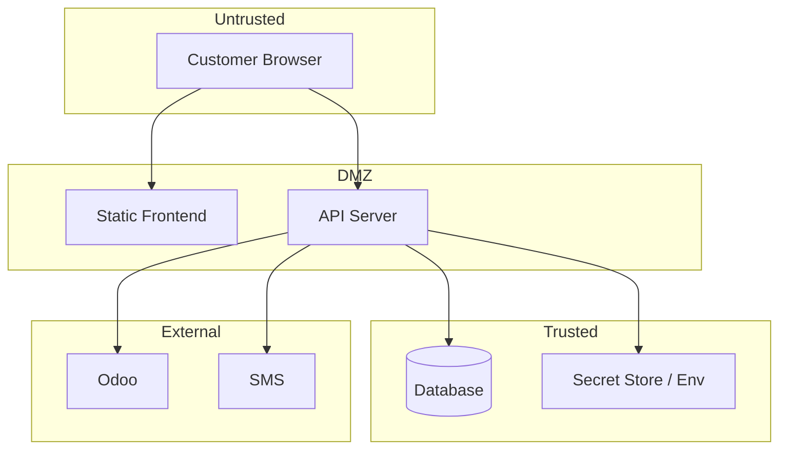

# Security Architecture — RAWAQA

> **Canonical:** [../08-security/Security-Specification.md](../08-security/Security-Specification.md)

## Layers

| Layer | Controls |
|-------|----------|
| Edge | HTTPS, TLS 1.2+, security headers |
| API | JWT auth, RBAC, rate limiting, input validation |
| Data | Parameterized queries, PII access control |
| Secrets | Env vars only; never in git or frontend |
| Integrations | Redacted logs; timeout + retry |

## Trust Boundaries

## Admin Isolation

Admin routes separate from public; require `role=admin`. No admin links in customer nav.

See [Auth-Security.md](Auth-Security.md) and [Threat-Model.md](Threat-Model.md).
