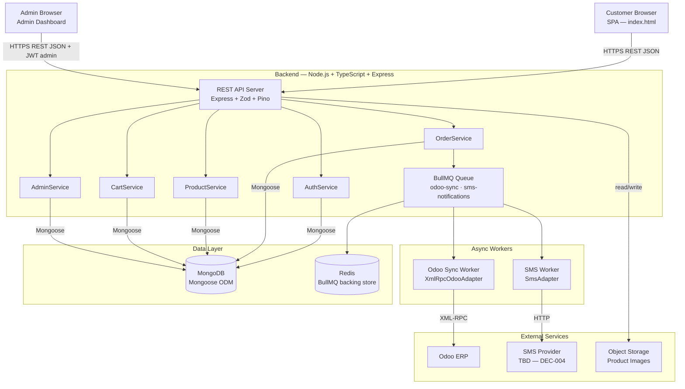
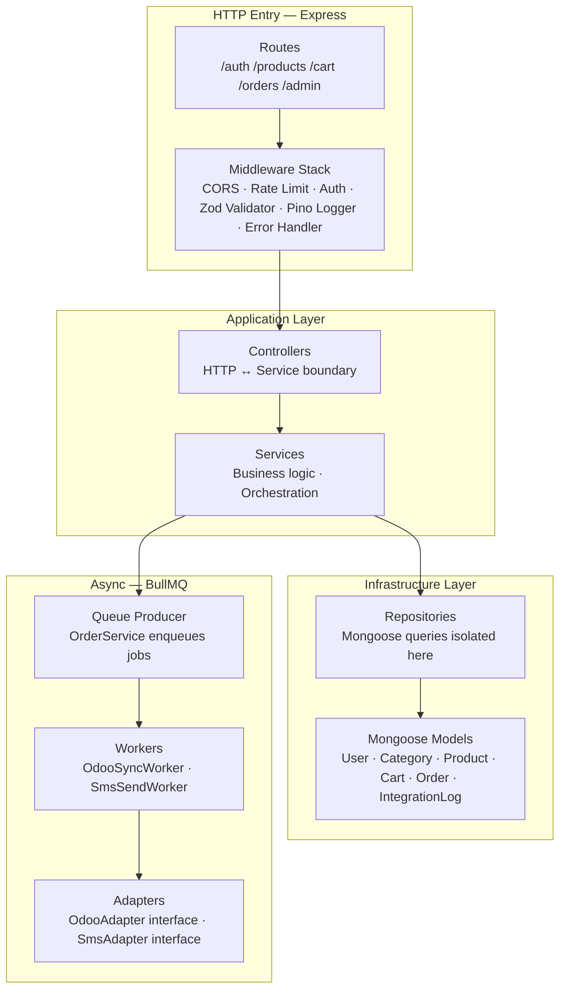
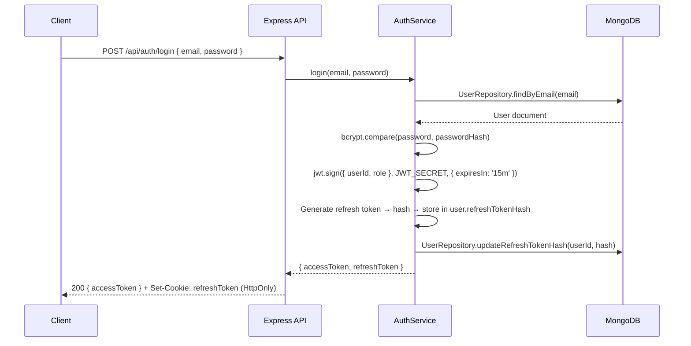
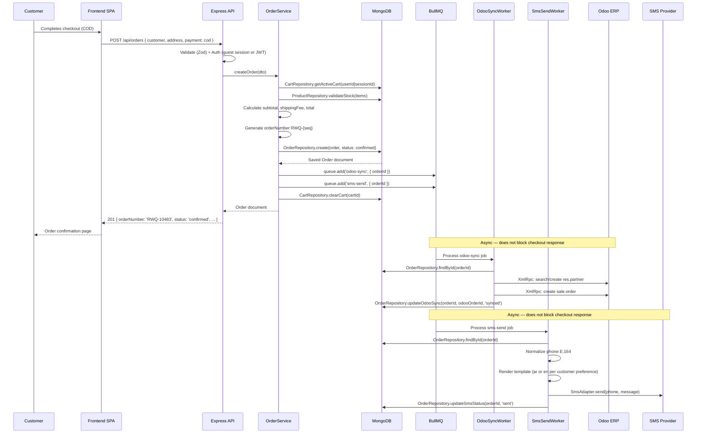
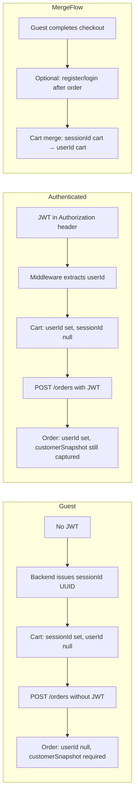

# System Architecture — RAWAQA

**Document ID:** RAWAQA-ARCH-001
**Version:** 2.0
**Last Updated:** 2026-09-02
**Status:** Target architecture — Backend **Not Yet Implemented**

> **⚠️ SUPERSEDED HISTORY:** Version 1.0 referenced PostgreSQL as the data layer and left the backend stack as TBD. Both are now resolved. The canonical stack is **Node.js + TypeScript + Express + MongoDB + Mongoose**. Do NOT reference PostgreSQL, Prisma, or SQL in any new implementation work.

---

## 1. Architecture Style

| Layer | Current State | Target State |
|-------|--------------|-------------|
| Presentation | Static SPA (HTML/CSS/ES5 JS) | SPA connected to REST API |
| Application | None | Node.js + TypeScript + Express |
| Data | In-memory JS array | MongoDB via Mongoose |
| Async Jobs | None | BullMQ + Redis |
| Integration | None | Odoo XML-RPC adapter + SMS adapter |

**Pattern:** Layered architecture — Frontend → REST API → Services → Repositories → Mongoose → MongoDB.

**Business logic separation:** Controllers handle HTTP concerns only. Services contain business rules. Repositories isolate all Mongoose/database calls.

---

## 2. High-Level System Architecture



---

## 3. Backend Layer Architecture



### Layer Responsibilities

| Layer | Responsibility | Must NOT contain |
|-------|---------------|-----------------|
| Routes | Define endpoints, attach middleware | Business logic |
| Controllers | Parse request, call service, format response | Business rules, DB queries |
| Services | Business workflows, orchestration | Raw Mongoose queries, HTTP request parsing |
| Repositories | All Mongoose/MongoDB interactions | Business logic |
| Mongoose Models | Schema, indexes, virtuals | Business logic |
| Workers | Job execution, retry coordination | HTTP request handling |
| Adapters | External service protocol | Business logic |

---

## 4. Proposed Directory Structure

```
src/
├── routes/
│   ├── auth.routes.ts
│   ├── product.routes.ts
│   ├── cart.routes.ts
│   ├── order.routes.ts
│   └── admin/
│       ├── product.routes.ts
│       └── order.routes.ts
├── controllers/
│   ├── auth.controller.ts
│   ├── product.controller.ts
│   ├── cart.controller.ts
│   ├── order.controller.ts
│   └── admin/
├── services/
│   ├── auth.service.ts
│   ├── product.service.ts
│   ├── cart.service.ts
│   ├── order.service.ts
│   └── admin.service.ts
├── repositories/
│   ├── user.repository.ts
│   ├── category.repository.ts
│   ├── product.repository.ts
│   ├── cart.repository.ts
│   ├── order.repository.ts
│   └── integrationLog.repository.ts
├── models/
│   ├── User.ts
│   ├── Category.ts
│   ├── Product.ts
│   ├── Cart.ts
│   ├── Order.ts
│   └── IntegrationLog.ts
├── jobs/
│   ├── queues.ts           ← BullMQ queue definitions
│   ├── odooSync.worker.ts
│   └── smsSend.worker.ts
├── adapters/
│   ├── odoo/
│   │   ├── OdooAdapter.ts         ← Interface
│   │   └── XmlRpcOdooAdapter.ts   ← Implementation
│   └── sms/
│       ├── SmsAdapter.ts          ← Interface
│       └── ConsoleSmsAdapter.ts   ← Dev/test implementation
├── middleware/
│   ├── auth.middleware.ts
│   ├── adminOnly.middleware.ts
│   ├── rateLimiter.middleware.ts
│   ├── validate.middleware.ts     ← Zod schema validator
│   └── errorHandler.middleware.ts
├── validators/
│   ├── auth.validators.ts
│   ├── product.validators.ts
│   ├── cart.validators.ts
│   └── order.validators.ts
├── utils/
│   ├── phone.ts            ← E.164 normalization
│   ├── orderNumber.ts      ← RWQ-{seq} generation
│   └── localizedField.ts   ← { ar, en } helper
├── config/
│   └── env.ts              ← Typed env loader (Zod)
└── app.ts                  ← Express app factory
```

---

## 5. Authentication Architecture



**Token policy (DEC-006):**
- Access token: 15 minutes expiry, JWT signed with `JWT_SECRET`
- Refresh token: 7 days expiry, stored as hash in `users.refreshTokenHash`
- Admin routes: JWT payload must contain `role: 'admin'`
- Guest carts/orders: identified by `X-Session-ID` header (UUID v4, set by backend on first cart interaction)

---

## 6. Order Creation Flow (with Async Jobs)



---

## 7. Guest vs Authenticated Cart/Checkout



---

## 8. Localization Flow

```mermaid
flowchart LR
    FE[Frontend\nlang state: 'ar' or 'en']
    FE -->|Accept-Language: ar| API
    FE -->|Accept-Language: en| API
    API --> SVC[Service\nreads lang from request]
    SVC --> RESP[Response\n{ name: 'استرخاء' } or { name: 'Relax' }]
    RESP --> FE2[Frontend\nrenders in selected language + direction]
```

Default language when `Accept-Language` is absent or unsupported: **Arabic (`ar`)** — DEC-023.

Full localization architecture: `docs/03-architecture/Localization-Architecture.md`

---

## 9. Technology Stack Summary

| Concern | Technology | Decision |
|---------|-----------|---------|
| Backend runtime | Node.js | DEC-002 |
| Backend language | TypeScript | DEC-002 |
| HTTP framework | Express | DEC-002 |
| Database | MongoDB | DEC-003-MONGODB |
| ODM | Mongoose | DEC-003-MONGODB |
| Authentication | JWT (15m/7d) | DEC-006 |
| Password hashing | bcrypt cost ≥ 12 | DEC-006 |
| Input validation | Zod | DEC-018 |
| Logging | Pino | DEC-019 |
| Async jobs | BullMQ + Redis | DEC-017 |
| Testing | Jest + Supertest | DEC-020 |
| Odoo protocol | XML-RPC (adapter) | DEC-021 |
| SMS (dev) | Console/Mock adapter | DEC-022 |
| SMS (prod) | TBD — DEC-004 | OPEN |
| Hosting | TBD — DEC-014 | OPEN |
| Frontend | Vanilla HTML/CSS/ES5 JS | DEC-011 |

---

## 10. Architecture Decisions (Summary)

| Decision | Status | Reference |
|----------|--------|-----------|
| Custom platform (no CMS) | Accepted | DEC-001 |
| Node.js + TypeScript + Express | Accepted | DEC-002 |
| MongoDB + Mongoose | Accepted | DEC-003-MONGODB |
| ~~PostgreSQL + Prisma~~ | ⚠️ Superseded | DEC-003 |
| COD only at launch | Accepted | DEC-005 |
| JWT auth (15m/7d) | Accepted | DEC-006 |
| BullMQ + Redis | Accepted | DEC-017 |
| Zod validation | Accepted | DEC-018 |
| Pino logging | Accepted | DEC-019 |
| Jest + Supertest | Accepted | DEC-020 |
| Odoo: adapter + XML-RPC | Accepted | DEC-021 |
| SMS: adapter + console dev | Accepted | DEC-022 |
| Arabic default language | Accepted | DEC-023 |
| Guest checkout enabled | Accepted | DEC-013 |
| Arabic + English from MVP | Accepted | DEC-015 |
| Hosting provider | OPEN | DEC-014 |
| SMS provider (prod) | OPEN | DEC-004 |
| Language persistence mechanism | OPEN | DEC-024 |
| MongoDB hosting (Atlas vs VPS) | OPEN | DEC-025 |

---

## 11. Quality Attribute Priorities

1. **Reliability** — Orders never lost even if Odoo or SMS fails (async non-blocking)
2. **Security** — JWT auth, Zod validation, NoSQL injection prevention, secrets in env only
3. **Correctness** — Business rules enforced in service layer, not controllers
4. **Usability** — Arabic-first bilingual experience, mobile-first checkout
5. **Maintainability** — Adapter pattern for integrations, repository pattern for DB access

---

## Related Documents

- Data model: `docs/05-database/ERD.md`
- Field semantics: `docs/05-database/Data-Dictionary.md`
- API spec: `docs/04-api/API-Design.md`
- Localization: `docs/03-architecture/Localization-Architecture.md`
- Auth details: `docs/03-architecture/Auth-Security.md`
- Security: `docs/08-security/Security-Specification.md`
- Odoo: `docs/06-integrations/Odoo-Integration-Specification.md`
- SMS: `docs/06-integrations/SMS-Integration-Specification.md`
- Environment: `docs/10-deployment/Environment-Configuration.md`
