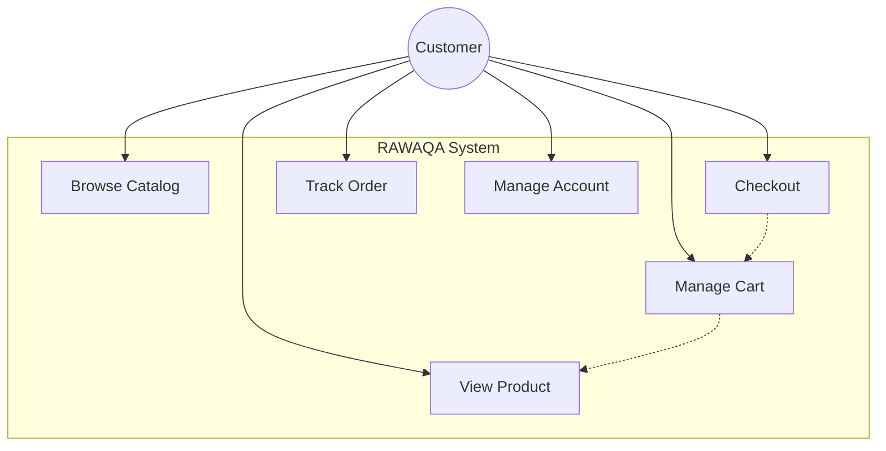
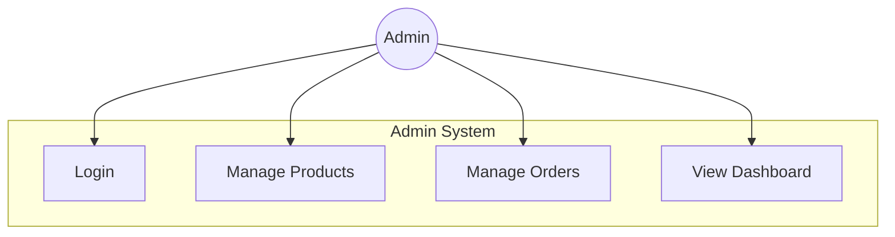
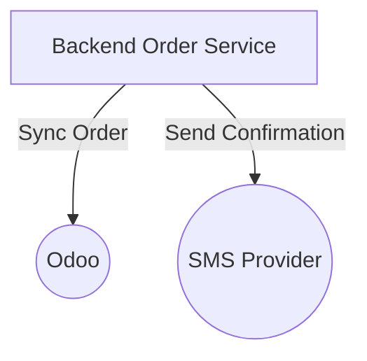

# Use Case Diagrams — RAWAQA

## Customer — Purchase

| Use Case | Status |
|----------|--------|
| Browse Catalog | Partial |
| View Product | Partial |
| Manage Cart | Partial |
| Checkout | Not Implemented |
| Track Order | Partial |
| Manage Account | Not Implemented |

---

## Admin — Operations

**Status:** All Not Yet Implemented

---

## System — Integrations

**Status:** Integration Required
