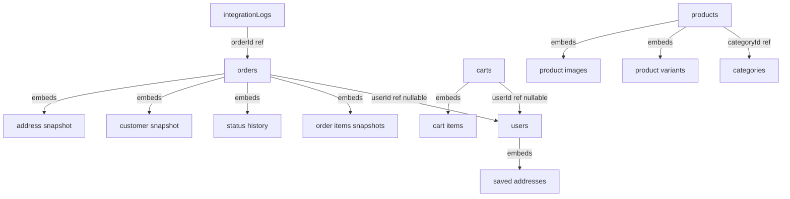

# Data Model — RAWAQA (MongoDB)

**Document ID:** RAWAQA-DB-001
**Version:** 2.0
**Last Updated:** 2026-09-02
**Status:** Target schema — Database **Not Yet Implemented**
**Database:** MongoDB
**ODM:** Mongoose (Node.js + TypeScript)

> **⚠️ SUPERSEDED HISTORY:** Version 1.0 of this document described a PostgreSQL relational schema with Prisma. That architecture was superseded by DEC-003-MONGODB (2026-09-02). Do NOT implement any PostgreSQL tables, SQL migrations, or Prisma schema files. The canonical database is MongoDB.

---

## 1. Modeling Philosophy

MongoDB is a document database. This schema is **not** a direct translation of a relational model into collections. Each entity decision below documents **why** the chosen strategy (embedded vs referenced) was selected.

### Core Principles

- **Embed** data that is always read together with its parent and does not need independent querying.
- **Reference** data that is queried independently, updated frequently, or shared across multiple documents.
- **Snapshot** mutable data at the time of a business event (order creation) so historical reads never depend on later mutations.
- **Localize** human-readable content using `{ ar: string, en: string }` embedded objects — never duplicate documents for language.

---

## 2. Collections Overview

| Collection | Strategy | Rationale |
|------------|----------|-----------|
| `users` | Separate collection | Queried independently; referenced by carts and orders |
| `categories` | Separate collection | Small, queried independently, referenced by products |
| `products` | Separate collection | Core catalog entity; queried with filters/search |
| `carts` | Separate collection, items embedded | Cart items are always read with cart; small bounded size |
| `orders` | Separate collection, items embedded | Order items are immutable snapshots; always read with order |
| `integrationLogs` | Separate collection | High-volume audit trail; never embedded |

**Entities that do NOT become separate collections (embedded instead):**

| Entity | Embedded In | Rationale |
|--------|-------------|-----------|
| Product variants | `products` | Variants are always fetched with product; max ~20 per product |
| Product images | `products` | Always displayed with product; small array |
| Cart items | `carts` | Always read with cart; deleted when cart is cleared |
| Order items | `orders` | Immutable snapshots; always read with order |
| Order status history | `orders` | Always displayed with order; append-only; bounded size |
| Customer snapshot | `orders` | Point-in-time capture; immutable after order creation |
| Shipping address snapshot | `orders` | Point-in-time capture; immutable after order creation |
| User saved addresses | `users` | Typically ≤ 5 per user; always fetched with profile |

---

## 3. Localization Pattern

All human-readable text that must appear in Arabic and English uses this embedded object:

```
LocalizedString {
  ar: String   // Arabic text — REQUIRED
  en: String   // English text — REQUIRED if content exists
}
```

**Fallback rule (DEC-023):** If `ar` is missing, fall back to `en`. If `en` is missing, fall back to `ar`. If both are missing, the document is invalid. The API response includes a `translationMissing: true` flag when a fallback is applied.

**Fields that are localized:** `product.name`, `product.description`, `product.longDescription`, `category.name`, `category.description`.

**Fields that are NOT localized** (language-independent): slugs, SKUs, prices, quantities, statuses, phone numbers, email addresses, order numbers, timestamps.

---

## 4. Collection: `users`

**Purpose:** Stores both customers and admins. Role field distinguishes them.

```
users {
  _id:              ObjectId       — MongoDB default primary key
  email:            String         — Unique, indexed, lowercase normalized
  phone:            String         — Unique, indexed, E.164 format (+20xxxxxxxxx)
  passwordHash:     String         — bcrypt hash, cost ≥ 12; never exposed in API
  fullName:         String         — Display name
  role:             String         — Enum: 'customer' | 'admin'
  refreshTokenHash: String         — Hash of current refresh token (nullable)
  savedAddresses:   Address[]      — Embedded array (see sub-document below)
  createdAt:        Date
  updatedAt:        Date
}

Address sub-document {
  _id:          ObjectId
  governorate:  String
  city:         String
  street:       String
  notes:        String    — Optional delivery notes
  isDefault:    Boolean
}
```

**Indexes:**
- `{ email: 1 }` unique
- `{ phone: 1 }` unique
- `{ role: 1 }` (admin queries)

**Design decisions:**
- Saved addresses embedded — a user has ≤ 5–10 addresses; always loaded with profile.
- `refreshTokenHash` stored here so token rotation does not require a separate collection at MVP.
- Admin users are in the same collection — `role: 'admin'` is the discriminator.

---

## 5. Collection: `categories`

**Purpose:** Product category taxonomy. Fixed at MVP: Relax, Game, Kids, Outdoor.

```
categories {
  _id:         ObjectId
  name:        LocalizedString    — { ar: 'استرخاء', en: 'Relax' }
  description: LocalizedString    — Optional category description
  slug:        String             — URL-safe, language-independent (e.g. 'relax')
  sortOrder:   Number             — Display order
  active:      Boolean
}
```

**Indexes:**
- `{ slug: 1 }` unique

**Design decisions:**
- Separate collection so products reference category `_id` without denormalization.
- Category name is localized; slug is not (single canonical identifier).

---

## 6. Collection: `products`

**Purpose:** Core product catalog with embedded variants and images.

```
products {
  _id:              ObjectId
  slug:             String             — Unique, URL-safe, language-independent
  name:             LocalizedString    — { ar: '...', en: 'The Cloud Lounger' }
  description:      LocalizedString    — Short description for cards
  longDescription:  LocalizedString    — Full description for PDP accordion
  categoryId:       ObjectId           — Ref: categories._id
  basePrice:        Number             — EGP, numeric (e.g. 3450, NOT "EGP 3,450")
  featured:         Boolean            — Homepage featured section
  active:           Boolean            — Visible in shop
  images:           ProductImage[]     — Embedded array
  variants:         ProductVariant[]   — Embedded array
  createdAt:        Date
  updatedAt:        Date
}

ProductImage sub-document {
  _id:       ObjectId
  url:       String     — Storage URL or path
  altText:   LocalizedString
  sortOrder: Number
}

ProductVariant sub-document {
  _id:           ObjectId
  sku:           String    — Unique across all variants globally (enforced by sparse index)
  color:         String    — e.g. 'Terracotta'
  size:          String    — e.g. 'Large'
  price:         Number    — Override price in EGP; if null, inherits basePrice
  stockQuantity: Number    — >= 0
  active:        Boolean
}
```

**Indexes:**
- `{ slug: 1 }` unique
- `{ 'variants.sku': 1 }` sparse, unique — enforces global SKU uniqueness
- `{ categoryId: 1, active: 1 }` — shop filter queries
- `{ featured: 1, active: 1 }` — homepage featured section
- `{ active: 1, basePrice: 1 }` — price sort queries
- Text index on `{ 'name.ar': 'text', 'name.en': 'text', 'description.ar': 'text', 'description.en': 'text' }` — search

**Design decisions:**
- Variants embedded — a product has ≤ 20 variants; always fetched with product.
- Images embedded — small array; always displayed with product.
- `basePrice` is a Number, not a formatted string. The static JS prototype's `"EGP 3,450"` pattern is a known issue (ISSUE-008) and must be corrected.
- SKU uniqueness enforced at MongoDB level via sparse unique index on the embedded field path.
- `longDescription` is localized to support bilingual PDP accordion content.

---

## 7. Collection: `carts`

**Purpose:** Shopping cart for both authenticated users and guests.

```
carts {
  _id:       ObjectId
  userId:    ObjectId    — Ref: users._id — NULLABLE (null for guest carts)
  sessionId: String      — Required when userId is null; UUID v4 set by backend
  items:     CartItem[]  — Embedded array
  expiresAt: Date        — TTL index for guest cart cleanup
  updatedAt: Date
}

CartItem sub-document {
  _id:           ObjectId
  productId:     ObjectId   — Ref: products._id
  variantId:     ObjectId   — Ref to embedded products.variants._id
  sku:           String     — Snapshot of SKU at add-to-cart time
  productName:   LocalizedString  — Snapshot of name at add-to-cart time
  variantLabel:  String     — e.g. 'Terracotta · Large' — display snapshot
  priceSnapshot: Number     — Price at time of add-to-cart (EGP)
  quantity:      Number     — >= 1
}
```

**Indexes:**
- `{ userId: 1 }` sparse — find cart by user
- `{ sessionId: 1 }` sparse, unique — find guest cart by session
- `{ expiresAt: 1 }` TTL index — auto-delete expired guest carts (e.g. 7 days)

**Design decisions:**
- `userId` and `sessionId` are mutually exclusive in practice: a user cart has `userId` set and `sessionId` null; a guest cart has `sessionId` set and `userId` null.
- Cart items are embedded — a cart has ≤ 20 items; always fetched together.
- `priceSnapshot` and `productName` are captured at add-to-cart time for display consistency, but the authoritative price is re-validated from the product at checkout time.
- TTL index on `expiresAt` automatically cleans up abandoned guest carts without a cron job.
- When a guest user registers or logs in, the guest cart (`sessionId`) is merged into their user cart (`userId`).

---

## 8. Collection: `orders`

**Purpose:** Immutable purchase record. The most critical collection in the system.

```
orders {
  _id:              ObjectId
  orderNumber:      String         — Unique: 'RWQ-10483' format
  userId:           ObjectId       — Ref: users._id — NULLABLE (null for guest orders)
  status:           String         — Enum (see below)
  subtotal:         Number         — EGP
  shippingFee:      Number         — EGP (0 if free shipping ≥ 3000 EGP)
  total:            Number         — EGP
  paymentMethod:    String         — 'cod' (only value at MVP)
  customerSnapshot: CustomerSnapshot   — Required, immutable after creation
  shippingAddress:  AddressSnapshot    — Required, immutable after creation
  items:            OrderItem[]        — Immutable snapshots
  statusHistory:    StatusHistoryEntry[] — Append-only
  odooOrderId:      String         — Nullable; set after successful Odoo sync
  odooSyncStatus:   String         — Enum (see below)
  smsStatus:        String         — Enum (see below)
  createdAt:        Date
  updatedAt:        Date
}

CustomerSnapshot sub-document (immutable after order creation) {
  fullName:  String
  phone:     String   — E.164 format
  email:     String   — Optional
}

AddressSnapshot sub-document (immutable after order creation) {
  governorate: String
  city:        String
  street:      String
  notes:       String
}

OrderItem sub-document (immutable after order creation) {
  _id:          ObjectId
  productId:    ObjectId   — Reference (product may be deleted; snapshot fields preserve data)
  variantId:    ObjectId   — Reference
  sku:          String     — Snapshot
  productName:  LocalizedString  — Snapshot at purchase time { ar, en }
  variantLabel: String     — Snapshot: 'Terracotta · Large'
  quantity:     Number
  unitPrice:    Number     — EGP at purchase time
  lineTotal:    Number     — unitPrice × quantity
}

StatusHistoryEntry sub-document (append-only) {
  _id:       ObjectId
  status:    String
  note:      String    — Optional admin note
  createdAt: Date
}
```

**Order status enum:**
`pending` → `confirmed` → `preparing` → `shipped` → `delivered`
`cancelled` (from `pending` or `confirmed` only)

**odooSyncStatus enum:**
`pending` | `syncing` | `synced` | `failed` | `retrying`

**smsStatus enum:**
`pending` | `sent` | `failed` | `skipped`

**Indexes:**
- `{ orderNumber: 1 }` unique
- `{ userId: 1 }` sparse — customer order history
- `{ status: 1 }` — admin order list filtering
- `{ createdAt: -1 }` — default sort (newest first)
- `{ odooSyncStatus: 1 }` — admin failed sync view
- `{ 'customerSnapshot.phone': 1 }` — order lookup by phone

**Design decisions:**
- `customerSnapshot` and `shippingAddress` embedded — captures state at order time. If the customer later changes their phone or address, past orders are unaffected.
- Order items embedded — immutable snapshots; always read with the order. Product name in both languages captured so track-order page displays in user's language.
- `statusHistory` embedded and append-only — powers the track-order timeline. Bounded by the number of status transitions (typically ≤ 6).
- `userId` is nullable to support guest orders (DEC-013).
- `orderNumber` is a separate field — not derived from `_id`. Format: `RWQ-{sequential}`.

---

## 9. Collection: `integrationLogs`

**Purpose:** Audit trail for all Odoo and SMS API calls. High-volume; never embedded.

```
integrationLogs {
  _id:             ObjectId
  orderId:         ObjectId   — Ref: orders._id
  provider:        String     — Enum: 'odoo' | 'sms'
  direction:       String     — 'outbound'
  status:          String     — Enum: 'success' | 'failed' | 'retry'
  requestPayload:  Object     — Sanitized; secrets redacted
  responsePayload: Object     — Provider response
  errorMessage:    String     — Nullable
  attemptNumber:   Number     — Retry attempt (1 = first attempt)
  createdAt:       Date
}
```

**Indexes:**
- `{ orderId: 1, provider: 1 }` — find all logs for an order
- `{ provider: 1, status: 1 }` — admin failure dashboard
- `{ createdAt: 1 }` TTL — optional: auto-expire logs after 90 days

**Design decisions:**
- Separate collection — high-volume, queried independently of orders.
- Payload fields are plain objects, not typed sub-documents — provider schemas vary and are not worth enforcing at ODM level.

---

## 10. Conceptual Relationship Diagram

The following shows **logical relationships** only. These are not foreign key constraints — they are application-level references enforced by the repository layer.



---

## 11. Seed Data

Initial seed must populate:
- 4 categories: Relax, Game, Kids, Outdoor (with both `ar` and `en` names)
- 8 products from `js/main.js` `PRODUCTS` array (with `ar` and `en` content — client to provide Arabic copy)
- Product variants for each product (SKUs from prototype: CL-TR-L, etc.)
- 1 admin user (email and password from client)

**Note:** Seed scripts use Mongoose models, not SQL migrations.

---

## 12. Schema Enforcement Strategy

MongoDB does not enforce schema by default. Enforcement happens at two layers:

| Layer | Tool | Scope |
|-------|------|-------|
| ODM validation | Mongoose schema `required`, `enum`, `min`, `max` | Before any write |
| Application validation | Zod schemas on API input | Before reaching service layer |
| Database constraint | Unique indexes | `email`, `phone`, `slug`, `sku`, `orderNumber` |

MongoDB schema validation (`$jsonSchema`) is optional and can be added to enforce structure at the database level post-MVP.

---

## Related Documents

- Field-level detail: `docs/05-database/Data-Dictionary.md`
- API shapes: `docs/04-api/API-Design.md`
- Localization architecture: `docs/03-architecture/Localization-Architecture.md`
- Environment config: `docs/10-deployment/Environment-Configuration.md` (`MONGODB_URI`)
- Decision: `docs/00-ai/Decision-Log.md` DEC-003-MONGODB
