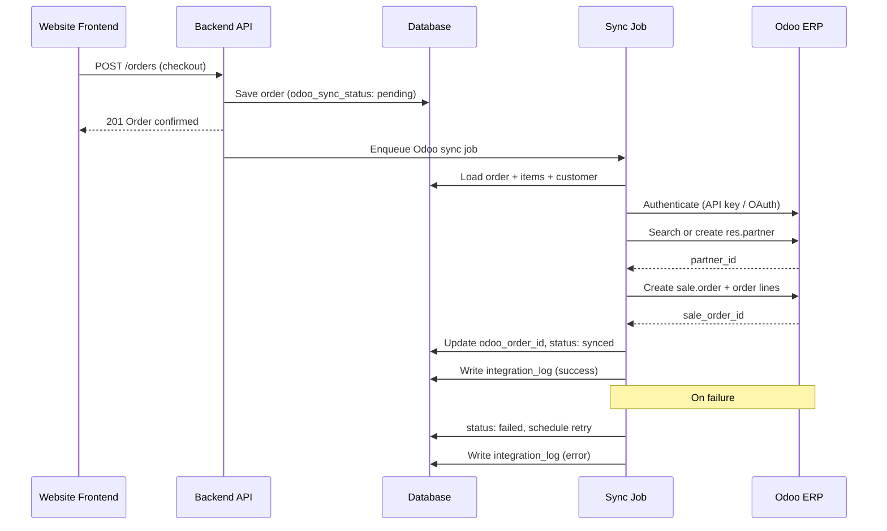

# Odoo Integration Specification — RAWAQA

**Budget:** 7,000 EGP (development & integration)  
**Status:** Integration Required — Not Yet Implemented  
**Workflow:** Website → Backend → Odoo API

---

## 1. Scope Boundary

### In Scope (7,000 EGP)

| Capability | Description |
|------------|-------------|
| Customer data | Create/update Odoo `res.partner` on order |
| Order data | Create Odoo `sale.order` with line items |
| Order mapping | Map website order fields to Odoo fields |
| API authentication | Secure credential storage, authenticated requests |
| Error handling | Catch, log, surface failures |
| Retry strategy | Exponential backoff on transient failures |
| Duplicate prevention | Idempotent push per website order ID |
| Sync status | Track `odoo_sync_status` on orders table |
| Integration logging | Persist request/response in `integration_logs` |
| Testing | Staging tests with client Odoo sandbox |

### Explicitly Out of Scope

- Accounting / invoicing automation  
- Full inventory synchronization (bidirectional)  
- POS integration  
- Advanced shipping module configuration  
- Payment synchronization  
- Full ERP synchronization  
- Other Odoo modules unless Change Request approved  

---

## 2. Integration Architecture



---

## 3. Authentication

| Item | Specification |
|------|---------------|
| Method | Odoo XML-RPC or JSON-RPC / External API (per client Odoo version) |
| Credentials | `ODOO_URL`, `ODOO_DB`, `ODOO_USERNAME`, `ODOO_API_KEY` in env |
| Storage | Server environment only — never frontend |
| Rotation | Client rotates API key; update env without redeploy if possible |

---

## 4. Data Mapping

### Customer → `res.partner`

| Website Field | Odoo Field | Notes |
|---------------|------------|-------|
| full_name | name | Required |
| phone | phone / mobile | Primary contact |
| email | email | If provided |
| shipping_address.street | street | |
| shipping_address.city | city | |
| shipping_address.governorate | state_id or custom field | Map governorates |
| — | customer_rank | Mark as customer |
| website user id | ref or comment | Traceability |

### Order → `sale.order`

| Website Field | Odoo Field | Notes |
|---------------|------------|-------|
| order_number | client_order_ref | RWQ-10482 |
| created_at | date_order | |
| partner_id | partner_id | From customer step |
| items[].product_name + sku | order_line | Product lookup by SKU or create line description |
| items[].quantity | product_uom_qty | |
| items[].unit_price | price_unit | EGP |
| total | — | Computed by Odoo |
| payment_method cod | note or payment term | COD annotation |

### Product Mapping Strategy

**MVP approach:** Match Odoo products by SKU on `product_variants.sku`. If no match, create order line with free-text description (configurable).

**Not in scope:** Automatic product catalog import from Odoo to website.

---

## 5. Request / Response Handling

```json
// Example logged request (redacted)
{
  "provider": "odoo",
  "action": "create_sale_order",
  "order_number": "RWQ-10483",
  "partner_id": 42,
  "lines": [
    { "sku": "CL-TR-L", "qty": 1, "price": 3450 }
  ]
}
```

**Success criteria:** HTTP/RPC success + valid Odoo sale order ID returned.

---

## 6. Error Handling

| Error Type | Action |
|------------|--------|
| Network timeout | Retry (max 3) |
| Auth failure | Fail immediately; alert admin |
| Partner creation failed | Retry once; then fail with log |
| Product SKU not found | Create line with description; log warning |
| Duplicate client_order_ref | Treat as success (idempotent) |
| Odoo 5xx | Retry with backoff |

---

## 7. Retry Strategy

| Attempt | Delay |
|---------|-------|
| 1 | Immediate |
| 2 | 30 seconds |
| 3 | 2 minutes |
| 4 | 10 minutes (final) |

After final failure: `odoo_sync_status = failed`; admin can manual retry via admin action (Planned).

---

## 8. Duplicate Prevention

- Before create: search `sale.order` by `client_order_ref = order_number`  
- Store `odoo_order_id` on website order after first success  
- Skip push if `odoo_sync_status = synced`  

---

## 9. Synchronization Status

| Status | Meaning |
|--------|---------|
| pending | Order saved; sync not attempted |
| syncing | Job in progress |
| synced | Odoo order created |
| failed | All retries exhausted |
| retrying | Scheduled retry |

---

## 10. Testing

| Test Case | Expected |
|-----------|----------|
| Happy path order | Odoo sale order created |
| Duplicate push | No duplicate Odoo order |
| Invalid credentials | Fail fast, logged |
| Odoo unavailable | Order saved; retry scheduled |
| Missing SKU | Order line with description |

---

## 11. Client Responsibilities

- Provide Odoo URL, database name, API credentials  
- Confirm Odoo version and available modules  
- Provide test/staging Odoo environment  
- Define governorate → state mapping if required  
- Maintain Odoo product SKUs if product matching desired  

---

## 12. Open Questions

1. Odoo Community vs Enterprise?  
2. Existing products in Odoo with SKUs?  
3. Should website orders auto-confirm in Odoo or stay draft?  
4. Warehouse/shipping rules handled manually in Odoo?
