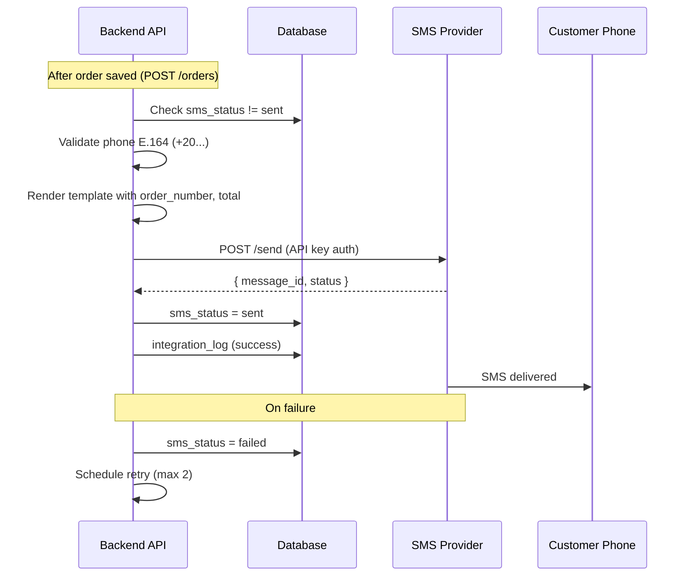

# SMS Integration Specification — RAWAQA

**Budget:** 3,000 EGP (development & integration)  
**Status:** Integration Required — Not Yet Implemented  
**Purpose:** Transactional order notifications

---

## 1. Scope

### In Scope (3,000 EGP)

| Capability | Description |
|------------|-------------|
| Provider abstraction | Pluggable SMS adapter interface |
| API integration | HTTP API to chosen provider |
| Authentication | Secure API key in environment |
| Message templates | Order confirmation template |
| Phone validation | Egyptian mobile format |
| Order confirmation SMS | Send on successful order creation |
| Error handling | Log failures; don't block order |
| Provider response logging | Store in `integration_logs` |
| Retry strategy | 2 retries on transient failure |
| Duplicate prevention | One confirmation SMS per order |
| Testing | Staging send to test numbers |

### Optional (Post-MVP / CR)

- Order status change SMS (shipped, delivered)  
- OTP for login  
- Marketing SMS campaigns  

---

## 2. External Costs (Client Responsibility)

The 3,000 EGP covers **development only**. Client pays separately:

| Cost Item | Notes |
|-----------|-------|
| SMS credits | Per message sent |
| Provider subscription | Monthly if applicable |
| Sender ID registration | Required in Egypt for branded sender |
| Usage fees | Per provider tariff |

---

## 3. Workflow



---

## 4. Provider Abstraction

```typescript
// Conceptual interface (implementation TBD)
interface SmsProvider {
  send(to: string, message: string): Promise<SmsResult>;
}

interface SmsResult {
  success: boolean;
  messageId?: string;
  error?: string;
}
```

**Supported providers (TBD with client):** Twilio, Infobip, local Egyptian gateway (e.g., Victory Link, SMS Misr — client to confirm).

---

## 5. Environment Variables

| Variable | Description |
|----------|-------------|
| `SMS_PROVIDER` | Provider identifier |
| `SMS_API_KEY` | API secret |
| `SMS_API_URL` | Base URL if custom |
| `SMS_SENDER_ID` | Registered sender name |
| `SMS_ENABLED` | `true` / `false` (disable in dev) |

**Never expose in frontend.**

---

## 6. Message Templates

### Order Confirmation (Arabic — primary market)

```
RAWAQA: تم تأكيد طلبك {order_number}. الإجمالي {total} جنيه. شكراً لثقتك بنا.
```

### Order Confirmation (English)

```
RAWAQA: Your order {order_number} is confirmed. Total EGP {total}. Thank you!
```

**Template variables:**
- `{order_number}` — RWQ-10482  
- `{total}` — Formatted EGP amount  
- `{customer_name}` — Optional first name  

---

## 7. Phone Validation

| Rule | Example |
|------|---------|
| Accept `01xxxxxxxxx` | 01012345678 |
| Normalize to E.164 | +201012345678 |
| Reject invalid length | Error before send |
| Required on checkout | Block order without phone |

---

## 8. Duplicate Prevention

1. Check `orders.sms_status` before send  
2. If `sent`, skip  
3. Use idempotency key: `order_id + event_type` in log  

---

## 9. Error Handling

| Scenario | Behavior |
|----------|----------|
| Invalid phone | Validation error at checkout (preferred) |
| Provider 4xx | Log; mark failed; no retry |
| Provider 5xx / timeout | Retry up to 2 times |
| Insufficient credits | Log; alert admin; order still confirmed |
| SMS disabled in env | Skip; `sms_status = skipped` |

**Critical rule:** SMS failure must **never** roll back a confirmed order.

---

## 10. Logging

Log to `integration_logs`:
- Provider name  
- Redacted phone (e.g., +2010****5678)  
- Message template ID  
- Provider message ID  
- Status code / error  

---

## 11. Testing

| Test | Method |
|------|--------|
| Valid Egyptian number | Staging send |
| Invalid number | Unit test validation |
| Provider mock | Integration test with stub |
| Duplicate send | Assert single SMS per order |
| Provider down | Order succeeds; SMS retries |

---

## 12. Client Responsibilities

- Select SMS provider  
- Register sender ID  
- Fund SMS credits  
- Provide test phone numbers for UAT  

---

## 13. Security

- API keys in server env only  
- No SMS content with full payment card data (N/A for COD)  
- Rate limit SMS sends per order/IP to prevent abuse  
