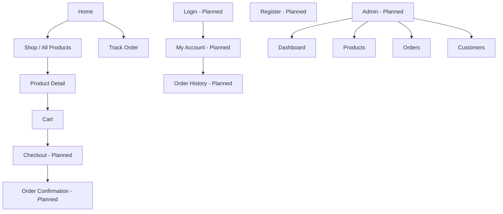
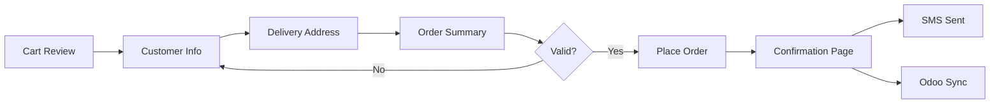
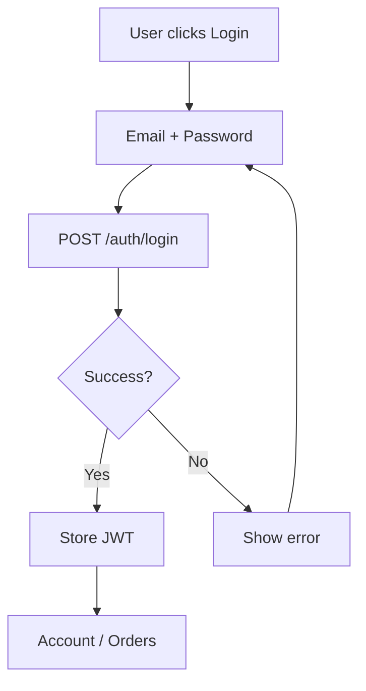
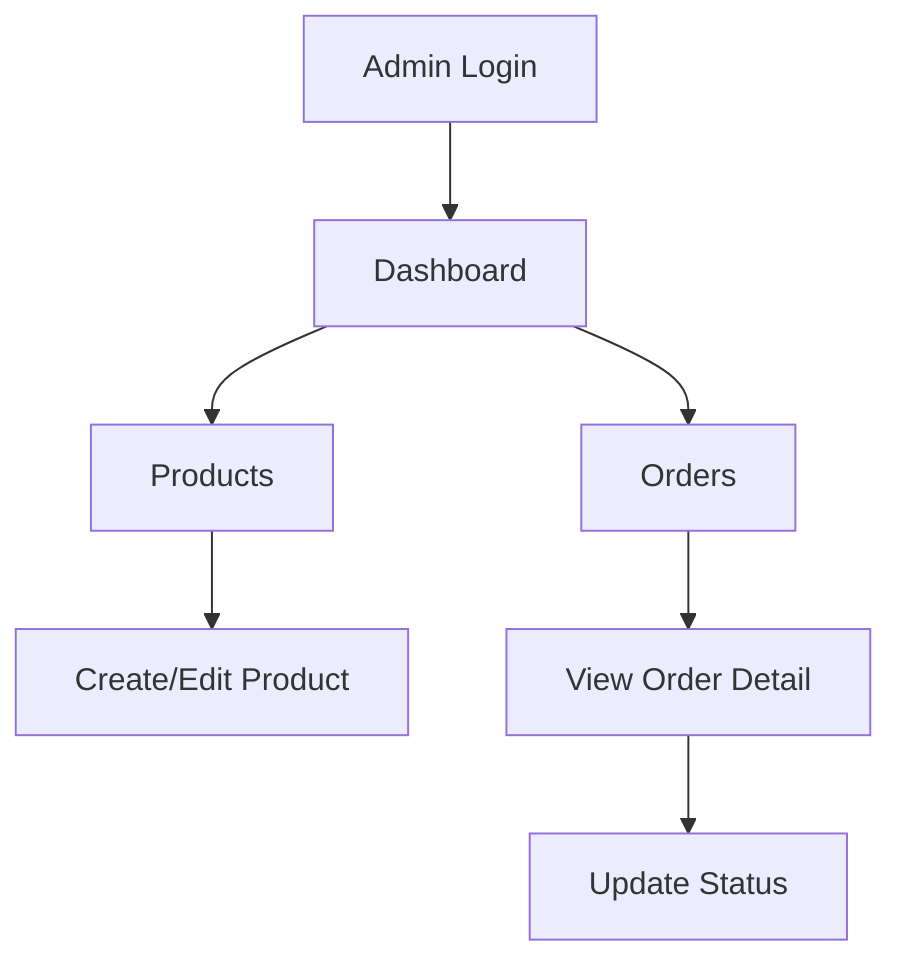

# UX Documentation — RAWAQA

## Information Architecture

### Sitemap (Current + Planned)

---

## Navigation Model

| Nav Item | Route | Status |
|----------|-------|--------|
| Logo / RAWAQA | home | Implemented |
| Shop | shop | Implemented |
| Collections | shop | Implemented (same as shop) |
| Why Rawaqa | home#why | Implemented |
| About | home#moment | Implemented |
| Track Order | track | Partial |
| Cart | cart | Partial |
| Search | — | Not wired |
| AR/EN | lang toggle | Partial |
| Account | — | Planned |

---

## User Flows

### Checkout Flow (Planned)

### Authentication Flow (Planned)

---

## Admin Flow (Planned)

---

## UI States

### Empty States

| Screen | Empty State | Current |
|--------|-------------|---------|
| Cart | "Your cart is empty" + Shop CTA | Not implemented — shows static items |
| Search results | "No products found" | N/A |
| Order history | "No orders yet" | N/A |
| Admin orders | "No orders" | N/A |

### Loading States

| Screen | Loading | Current |
|--------|---------|---------|
| Shop grid | Skeleton cards | Not implemented |
| Product detail | Skeleton | Not implemented |
| Checkout submit | Button disabled + spinner | N/A |
| Track order | Spinner on submit | Not implemented |

### Error States

| Screen | Error | Current |
|--------|-------|---------|
| Checkout | Inline field errors | N/A |
| Checkout | "Something went wrong" + retry | N/A |
| Track order | "Order not found" | N/A |
| API offline | Toast + retry | N/A |

### Success States

| Screen | Success | Current |
|--------|---------|---------|
| Add to cart | Toast "Added to your cart" | Implemented |
| Order placed | Confirmation page + order number | N/A |
| Lang switch | Toast EN/AR | Implemented |

---

## Responsive Behavior

| Breakpoint | Behavior | Status |
|------------|----------|--------|
| ≤880px | Hide desktop nav; show burger menu | Implemented |
| ≤880px | 2-column product grid | Implemented |
| ≤880px | Single column PDP, cart | Implemented |
| Desktop | Sticky filters (shop) | Implemented |
| Desktop | Sticky PDP info panel | Implemented |

---

## Design System (Implemented)

Reference: `css/styles.css` `:root` tokens

| Token | Value | Usage |
|-------|-------|-------|
| --charcoal | #15130F | Dark backgrounds |
| --ivory | #F7F4EC | Light backgrounds |
| --gold / --gold-light | #AD8A4C / #D2B56A | Accents, CTAs |
| --clay, --indigo, --ochre, --forest, --dune | Category colours | Product tiles |
| Fraunces | Serif | Headlines |
| Manrope + Noto Sans Arabic | Sans | Body text |

---

## Accessibility Notes

- `:focus-visible` outlines implemented  
- `aria-label` on icon buttons (cart, search, menu)  
- **Gap:** Form labels on track input; checkout forms not built  
- **Gap:** Alt text on product images (SVG placeholders)  

---

## RTL Support

**Current:** `langBtn` toggles `document.documentElement.dir` between `ltr` and `rtl`.

**Gap:** Content remains English; layout mirrors but text doesn't translate. Full i18n is Planned.
