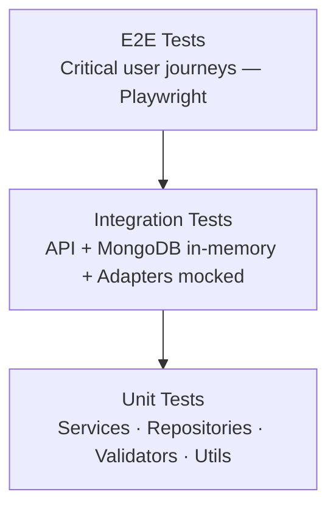

# Testing Strategy — RAWAQA

**Document ID:** RAWAQA-QA-001
**Version:** 2.0
**Last Updated:** 2026-09-02
**Status:** Strategy defined — Tests **Not Yet Implemented**

> **⚠️ UPDATED:** Version 1.0 left the testing framework as "Jest / pytest (stack TBD)". The stack is now confirmed: **Jest + Supertest** (DEC-020). Python/pytest is not applicable. All backend tests are TypeScript/JavaScript.

---

## 1. Goals

- Verify all commercial scope deliverables before production
- Ensure order → Odoo → SMS flow is reliable and non-blocking
- Validate MongoDB document integrity and Mongoose schema behaviour
- Prevent regressions in frontend UX across both Arabic and English
- Validate security controls on auth, admin routes, and NoSQL injection prevention
- Validate guest checkout and authenticated checkout flows independently

---

## 2. Testing Pyramid

| Layer | Tool | Target Coverage |
|-------|------|-----------------|
| Unit | Jest (TypeScript) | 70%+ backend services, utils, validators |
| Integration | Jest + Supertest + mongodb-memory-server | All API endpoints |
| E2E | Playwright | 5 critical user journeys |
| Manual UAT | Client sign-off checklist | Required before launch |

---

## 3. Tooling (Confirmed)

| Layer | Tool | Decision |
|-------|------|---------|
| Backend unit + integration | **Jest** | DEC-020 |
| API HTTP testing | **Supertest** | DEC-020 |
| In-memory MongoDB | **mongodb-memory-server** | Enables isolated integration tests |
| Odoo adapter mocking | **Jest mocks** | DEC-021 — adapter pattern enables clean mocking |
| SMS adapter mocking | **Jest mocks / ConsoleSmsAdapter** | DEC-022 — adapter pattern enables clean mocking |
| BullMQ job testing | **Jest + bullmq test utilities** | Test job enqueueing and worker execution in isolation |
| E2E browser | **Playwright** | Covers bilingual + RTL/LTR flows |
| Load testing (optional) | k6 | Post-MVP |

---

## 4. Unit Tests

### Services

| Service | Test Cases |
|---------|-----------|
| `AuthService` | Register, login, invalid password, duplicate email, token generation, bcrypt cost |
| `ProductService` | List with filters (category, price, in-stock), search, featured, pagination |
| `CartService` | Add item, update quantity, remove item, clear, stock validation, guest vs user cart, price re-validation at checkout |
| `OrderService` | Create order (guest), create order (authenticated), stock deduction, order number format, free shipping threshold (≥ 3000 EGP), enqueues Odoo job, enqueues SMS job |
| `AdminService` | Product CRUD, order status transitions (valid + invalid), admin order list |

### Repositories

| Repository | Test Cases |
|-----------|-----------|
| `UserRepository` | Find by email, find by phone, create, update refreshTokenHash |
| `ProductRepository` | Find by slug, list with filters, text search, update stock |
| `CartRepository` | Find by userId, find by sessionId, add item, update, clear, TTL field set correctly |
| `OrderRepository` | Create, find by orderNumber, find by userId, update odooSyncStatus, update smsStatus, append status history |

### Validators (Zod schemas)

| Validator | Test Cases |
|-----------|-----------|
| Auth validators | Valid/invalid email, phone format (01x and +20x), password length |
| Order validators | Required fields, phone validation, governorate list, COD only |
| Product validators (admin) | Required localized fields, price numeric, SKU format |

### Utilities

| Utility | Test Cases |
|---------|-----------|
| `phone.ts` | `01012345678` → `+201012345678`, already E.164 unchanged, invalid format rejected |
| `orderNumber.ts` | Format: `RWQ-{seq}`, uniqueness, zero-padding |
| `localizedField.ts` | Returns `ar` when lang=ar, returns `en` when lang=en, fallback when one is missing, `translationMissing` flag set correctly |

---

## 5. Integration Tests (API)

All API integration tests use:
- **Supertest** for HTTP requests (no running server needed)
- **mongodb-memory-server** for an isolated MongoDB instance per test suite
- **Jest mocks** for Odoo adapter and SMS adapter

### Authentication Endpoints

| Test | Expected |
|------|---------|
| `POST /auth/register` — valid | 201, returns accessToken |
| `POST /auth/register` — duplicate email | 409 CONFLICT |
| `POST /auth/register` — invalid phone | 400 VALIDATION_ERROR |
| `POST /auth/login` — valid | 200, returns accessToken, sets refresh cookie |
| `POST /auth/login` — wrong password | 401 UNAUTHORIZED |
| `POST /auth/login` — rate limit exceeded | 429 |
| `GET /auth/me` — valid JWT | 200, returns user profile (no passwordHash) |
| `GET /auth/me` — expired JWT | 401 |

### Products Endpoints

| Test | Expected |
|------|---------|
| `GET /products` — Accept-Language: ar | Returns Arabic name/description |
| `GET /products` — Accept-Language: en | Returns English name/description |
| `GET /products` — no Accept-Language | Returns Arabic (default — DEC-023) |
| `GET /products?category=relax` | Returns only Relax products |
| `GET /products?q=cloud` | Returns matching products |
| `GET /products/:slug` — valid | 200, full product with variants |
| `GET /products/:slug` — invalid | 404 NOT_FOUND |

### Cart Endpoints

| Test | Expected |
|------|---------|
| `POST /cart/items` — guest (X-Session-ID) | 200, cart created with sessionId |
| `POST /cart/items` — authenticated (JWT) | 200, cart associated with userId |
| `POST /cart/items` — out of stock | 409 CONFLICT |
| `PATCH /cart/items/:id` — update quantity | 200, updated cart |
| `DELETE /cart/items/:id` | 200, item removed |

### Orders Endpoints

| Test | Expected |
|------|---------|
| `POST /orders` — guest checkout | 201, order created, userId null, customerSnapshot set |
| `POST /orders` — authenticated checkout | 201, order created, userId set |
| `POST /orders` — empty cart | 422 UNPROCESSABLE |
| `POST /orders` — invalid phone | 400 VALIDATION_ERROR |
| `POST /orders` — stock conflict | 409 CONFLICT |
| `POST /orders` — subtotal ≥ 3000 | shippingFee = 0 |
| `POST /orders` — subtotal < 3000 | shippingFee > 0 |
| `POST /orders` — Odoo job enqueued | Mock verifies `queue.add('odoo-sync', ...)` called |
| `POST /orders` — SMS job enqueued | Mock verifies `queue.add('sms-send', ...)` called |
| `GET /orders/track/:orderNumber` — valid | 200, order status + history |
| `GET /orders/track/:orderNumber` — invalid | 404 |
| `GET /orders` — authenticated | 200, own orders only |
| `GET /orders` — unauthenticated | 401 |

### Admin Endpoints

| Test | Expected |
|------|---------|
| `GET /admin/orders` — admin JWT | 200, order list |
| `GET /admin/orders` — customer JWT | 403 FORBIDDEN |
| `GET /admin/orders` — no JWT | 401 UNAUTHORIZED |
| `PATCH /admin/orders/:id/status` — valid transition | 200, status updated |
| `PATCH /admin/orders/:id/status` — invalid transition | 422 |
| `POST /admin/products` — valid (ar + en) | 201, product created |
| `POST /admin/products` — missing ar name | 400 VALIDATION_ERROR |
| `DELETE /admin/products/:id` | 200, product set inactive |

### Security Tests (Integration)

| Test | Expected |
|------|---------|
| NoSQL injection: `{ "email": { "$gt": "" } }` on login | 400 (Zod rejects non-string) |
| NoSQL injection on product search | 400 (Zod rejects) |
| Admin route with customer JWT | 403 |
| Accessing another user's order | 403 |
| Guest sessionId on authenticated order history | 401 |

---

## 6. Job / Worker Tests

| Test | Expected |
|------|---------|
| OdooSyncWorker — successful sync | `order.odooSyncStatus` set to `synced`, `odooOrderId` saved |
| OdooSyncWorker — Odoo unavailable | Retry scheduled; status = `retrying` |
| OdooSyncWorker — max retries exhausted | Status = `failed`; integration log entry created |
| OdooSyncWorker — duplicate push (already synced) | Skipped (idempotent) |
| SmsSendWorker — successful send | `order.smsStatus` set to `sent` |
| SmsSendWorker — already sent | Skipped (idempotent) |
| SmsSendWorker — provider failure | Status = `failed`; order not cancelled |
| SmsSendWorker — SMS_ENABLED=false | Status = `skipped` |

---

## 7. Localization Tests

| Test | Expected |
|------|---------|
| `GET /products` Accept-Language: ar | `name` returns Arabic string |
| `GET /products` Accept-Language: en | `name` returns English string |
| `GET /products` unsupported language | Falls back to Arabic |
| Product with missing `en` translation | Returns `ar` value + `translationMissing: true` |
| Order items snapshot | Both `ar` and `en` names stored in `productName` |
| SMS worker, lang=ar | Arabic template used |
| SMS worker, lang=en | English template used |

---

## 8. E2E Test Scenarios (Playwright)

**Journey 1 — Guest Purchase (Arabic)**
1. Load site, language = Arabic, direction = RTL
2. Browse shop, filter by Relax category
3. Open product, select variant, add to cart
4. Proceed to checkout — enter Arabic name, Egyptian phone, address
5. Place order (COD)
6. Verify confirmation page shows RWQ- number
7. Track order — verify status shows in Arabic

**Journey 2 — Guest Purchase (English)**
1. Switch language to English, verify direction = LTR
2. Complete same purchase flow
3. Verify all UI labels are in English
4. Verify confirmation page in English

**Journey 3 — Authenticated Purchase**
1. Register account
2. Add to cart
3. Checkout as authenticated user
4. Verify order appears in order history

**Journey 4 — Admin Order Management**
1. Login as admin
2. View pending order
3. Update status to `confirmed` → `preparing` → `shipped`
4. Verify status history entries

**Journey 5 — Order Tracking**
1. Enter valid RWQ- number in track order page
2. Verify timeline displays correct statuses
3. Enter invalid number — verify 404 / not found state

---

## 9. Test Environments

| Environment | Purpose | MongoDB |
|-------------|---------|---------|
| Local | Developer unit + integration | `mongodb-memory-server` (in-process) |
| CI | Automated tests on PR | `mongodb-memory-server` |
| Staging | Full E2E with Odoo/SMS sandbox | Real MongoDB Atlas (staging cluster) |
| Production | Smoke tests post-deploy only | Real MongoDB Atlas (prod cluster) |

---

## 10. CI/CD Gates

All PRs must pass before merge:
- TypeScript compilation (`tsc --noEmit`)
- ESLint
- All unit tests (`jest --testPathPattern=unit`)
- All integration tests (`jest --testPathPattern=integration`)
- No P0/P1 open bugs

E2E tests run on staging before production promotion.

---

## 11. UAT Checklist (Client)

- [ ] Browse and purchase test product (Arabic)
- [ ] Browse and purchase test product (English)
- [ ] Verify RTL layout on Arabic mode (mobile)
- [ ] Verify LTR layout on English mode (mobile)
- [ ] Receive SMS on test phone number
- [ ] See order in Odoo (staging)
- [ ] Admin: add product with Arabic and English content
- [ ] Admin: update order status
- [ ] Track order works with real order number
- [ ] Sign-off document signed

---

## Related Documents

- Acceptance criteria: `docs/02-requirements/Acceptance-Criteria.md`
- Test plans: `docs/09-testing/QA-Test-Plans.md`
- Security tests: `docs/08-security/Security-Specification.md`
- Decision: `docs/00-ai/Decision-Log.md` DEC-020
