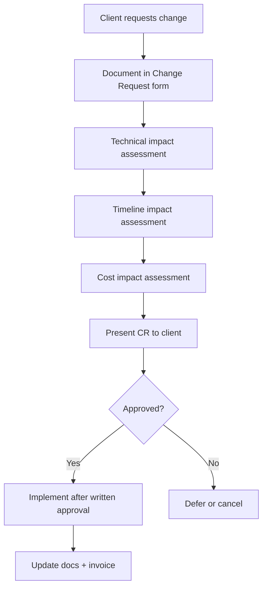

# Change Request System — RAWAQA

When the client requests work outside the agreed Scope of Work, the following process applies.

---

## Process Flow



---

## Change Request Form

| Field | Description |
|-------|-------------|
| **CR ID** | CR-001, CR-002, … |
| **Date** | Submission date |
| **Requested by** | Client name |
| **Description** | Clear description of requested change |
| **Business reason** | Why the change is needed |
| **Technical impact** | APIs, DB, integrations, frontend affected |
| **Timeline impact** | +X days/weeks |
| **Cost impact** | +X EGP |
| **Priority** | Must-have / Should-have / Nice-to-have |
| **Approval** | Client signature + date |
| **Implementation status** | Pending / Approved / In Progress / Complete |

---

## Example Change Requests

| CR | Request | Est. Impact |
|----|---------|-------------|
| CR-001 | Integrate Paymob payment gateway | +5 days, +8,000 EGP |
| CR-002 | Full Arabic translation (all pages) | +3 days, +4,000 EGP |
| CR-003 | Bidirectional Odoo inventory sync | +10 days, +15,000 EGP |
| CR-004 | WhatsApp order notifications | +3 days, +5,000 EGP |
| CR-005 | Product reviews submission | +4 days, +6,000 EGP |

*Examples for illustration only — actual quotes provided per request.*

---

## Rules

1. **No implementation without approval** — Work starts only after signed CR  
2. **Separate invoicing** — CR costs billed in addition to 35,000 EGP base  
3. **Timeline adjustment** — Approved CRs may shift milestone dates  
4. **Documentation update** — Approved CRs update FRS, API, and scope docs  
5. **Oral requests** — Not binding; must be documented in CR form  

---

## CR Template (Copy-Paste)

```
CHANGE REQUEST — RAWAQA
CR ID: CR-___
Date: ___________
Requested by: ___________

1. DESCRIPTION
   [What do you want changed or added?]

2. TECHNICAL IMPACT
   [To be completed by development team]

3. TIMELINE IMPACT
   [+___ days]

4. COST IMPACT
   [+___ EGP]

5. CLIENT APPROVAL
   Name: ___________  Signature: ___________  Date: ___________
```
