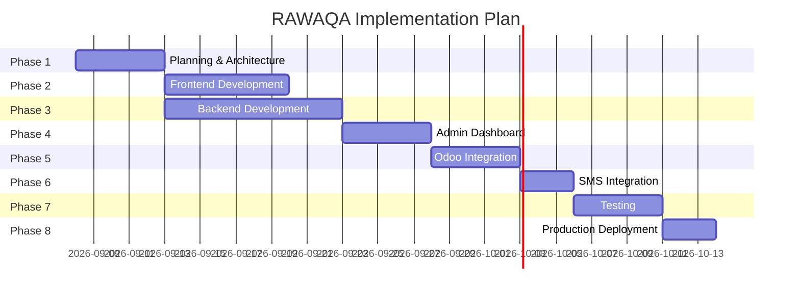

# Implementation Timeline — RAWAQA

**Duration:** 4–6 weeks  
**Start assumption:** Kickoff upon 40% payment receipt

---

## Phase Overview



---

## Phase 1 — Planning & Architecture (Week 1)

**Deliverables:**
- Finalized tech stack decision  
- Database schema (ERD) approved  
- OpenAPI contract v1  
- Environment setup (.env.example, docker-compose skeleton)  
- Gap analysis review with client  

**Dependencies:** Client confirms Odoo access, SMS provider preference  
**Exit criteria:** Architecture sign-off

---

## Phase 2 — Frontend Development (Week 2)

**Deliverables:**
- API client layer in frontend  
- Dynamic product catalog, shop filters  
- Functional cart UI connected to API  
- Checkout page (forms, validation UI)  
- Order confirmation page  
- Auth pages (login/register)  
- Customer account / order history  

**Dependencies:** Phase 1 API contract; Phase 3 API stubs or parallel backend  
**Builds on:** Existing `index.html`, `main.js`, `styles.css` prototype  

**Exit criteria:** Frontend works against staging API

---

## Phase 3 — Backend Development (Week 2–3)

**Deliverables:**
- PostgreSQL schema + migrations  
- Auth (register, login, JWT)  
- Product, cart, order APIs  
- Validation, error handling, logging  
- Seed data (8 prototype products)  

**Dependencies:** Phase 1 schema  
**Parallel with:** Phase 2 frontend integration  

**Exit criteria:** Postman/OpenAPI tests pass

---

## Phase 4 — Admin Dashboard (Week 3)

**Deliverables:**
- Admin authentication  
- Dashboard overview  
- Product CRUD with image upload  
- Order list, detail, status update  
- Customer read-only view  

**Dependencies:** Phase 3 backend APIs  

**Exit criteria:** Admin can manage catalog and orders on staging

---

## Phase 5 — Odoo Integration (Week 4)

**Deliverables:**
- Odoo adapter service  
- Order push on confirmation  
- Customer/partner mapping  
- Retry queue, sync status, logs  
- Staging test with client Odoo  

**Dependencies:** Client Odoo credentials; Phase 3 orders  
**Budget:** 7,000 EGP  

**Exit criteria:** Test order appears in Odoo staging

---

## Phase 6 — SMS Integration (Week 4–5)

**Deliverables:**
- SMS provider adapter  
- Order confirmation template  
- Phone validation  
- Logging and retry  
- Staging test to client test numbers  

**Dependencies:** Client SMS account; Phase 3 orders  
**Budget:** 3,000 EGP  

**Exit criteria:** Test SMS received on staging order

---

## Phase 7 — Testing (Week 5)

**Deliverables:**
- Execute QA test plan  
- E2E: purchase → Odoo → SMS  
- Security smoke tests  
- Bug fixes for P0/P1  
- UAT with client  

**Dependencies:** Phases 2–6 complete on staging  

**Exit criteria:** UAT checklist signed

---

## Phase 8 — Production Deployment (Week 5–6)

**Deliverables:**
- Production environment configured  
- Database migration on production  
- SSL, DNS, CORS  
- Smoke tests  
- Handover documentation  
- Final payment milestone (30%)  

**Dependencies:** Client DNS/hosting ready; UAT pass  
**Budget portion:** 3,000 EGP (testing/deployment allocation)  

**Exit criteria:** Production live; client sign-off

---

## Critical Path

```
Planning → Backend → Admin → Odoo → SMS → Testing → Deploy
                ↘ Frontend (parallel after API contract)
```

**Risk to timeline:** Delayed Odoo/SMS credentials from client adds 1–2 weeks.

---

## Milestone Payment Trigger

**30% milestone (10,500 EGP):** End of Phase 4 — Backend + Admin operational on staging.
